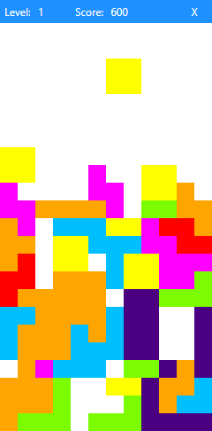

# Tetris
This project is a simple Tetris game.
	
## Technologies
Project is created with:
* WPF

## How to use
| Key | Function |
| --------------- | --------------- |
| ↑ | Rotation |
| ↓ | Fall down | 
| ← | Move left |
| → | Move right |

